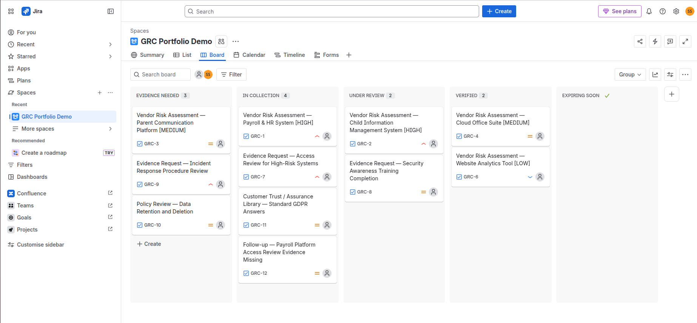
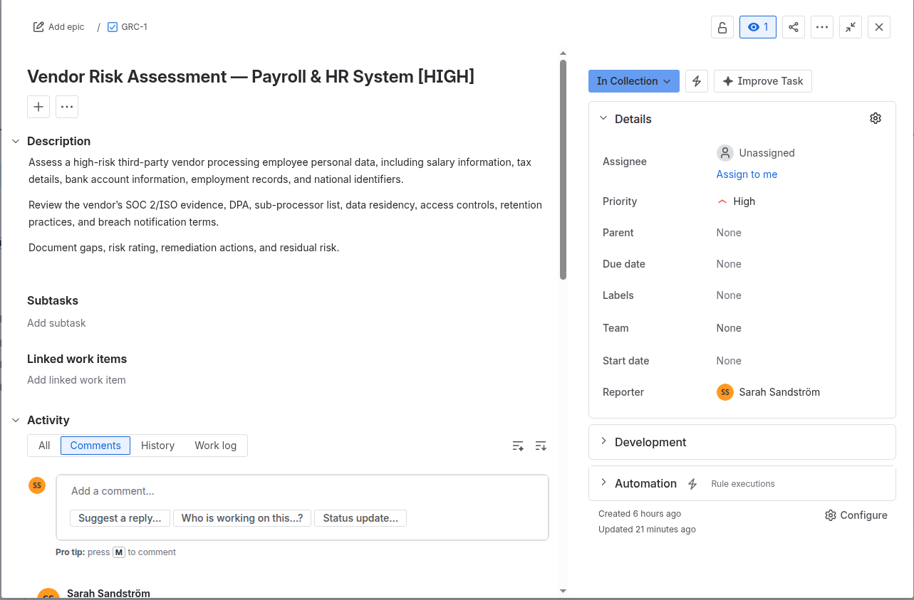
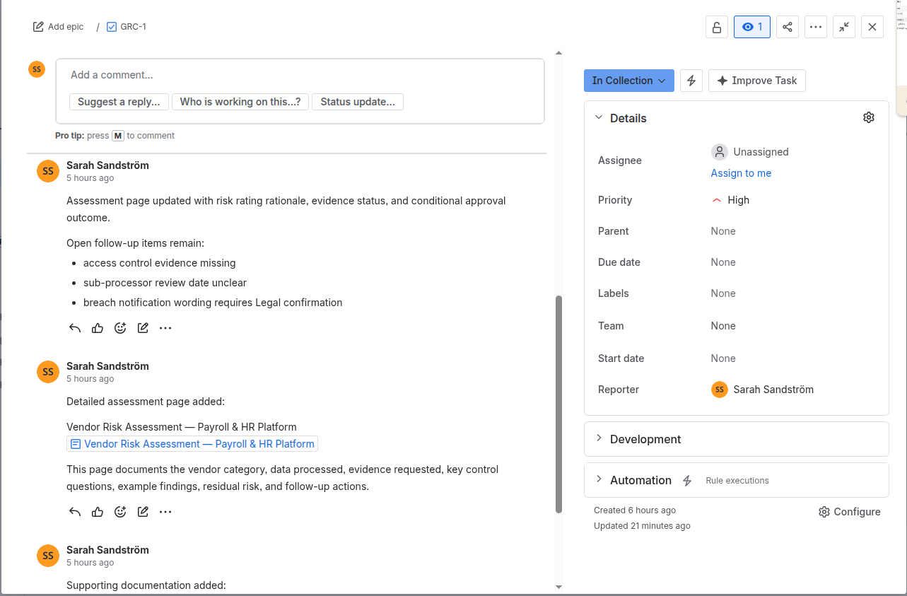
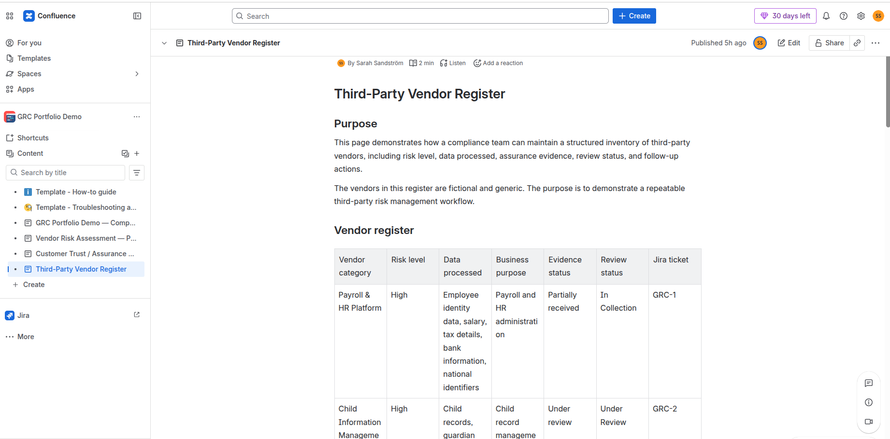
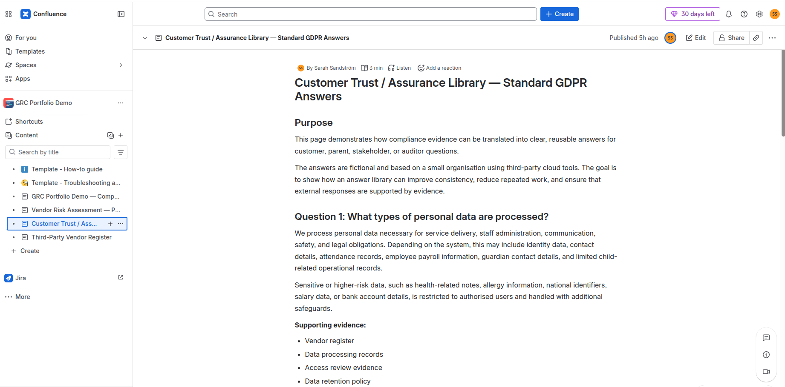

# GRC Portfolio Demo — High-Risk Vendor Assessment Workflow

## Project summary

This is a fictional Jira and Confluence compliance workflow demo created to practise the type of work involved in GRC, audit support, third-party vendor due diligence, and customer trust operations.

The demo focuses on one realistic workflow: assessing a high-risk third-party vendor, reviewing evidence, documenting residual risk, and tracking follow-up actions.

The scenario uses a fictional **Payroll & HR Platform** because this vendor category processes sensitive employee, financial, and identity data, such as salary information, tax details, bank account information, employment records, and national identifiers.

The goal was not to build a large compliance system, but to demonstrate one workflow clearly and carefully:

1. Risk classification  
2. Evidence request  
3. Evidence review  
4. Findings and gaps  
5. Conditional approval  
6. Residual risk  
7. Follow-up tracking  

---

## Why I built this

I built this demo to make my GRC learning concrete.

A Compliance Analyst role often involves collecting evidence, reviewing vendor documentation, maintaining vendor registers, supporting audits, answering customer trust questions, and following up with internal stakeholders.

I wanted to show how I would structure that work using tools such as **Jira** and **Confluence**, while also demonstrating judgement rather than only producing a checklist.

---

## Tools used

- **Jira** — evidence workflow tracking and follow-up actions
- **Confluence** — vendor assessment documentation, evidence review notes, vendor register, and reusable trust answers
- **GitHub** — public portfolio write-up and screenshots

---

## Workflow demonstrated

The demo follows one high-risk vendor assessment from intake to follow-up:

1. Identify the vendor and business purpose  
2. Review the data processed and its sensitivity  
3. Assign a risk level  
4. Request due diligence evidence  
5. Track received, missing, and incomplete evidence  
6. Review the quality of the evidence, not only whether it exists  
7. Document findings and open gaps  
8. Make a conditional approval decision  
9. Record residual risk  
10. Create follow-up actions in Jira  
11. Link supporting documentation in Confluence  
12. Reassess on a defined schedule  

---

## Jira workflow

The Jira board uses an evidence lifecycle workflow:

```text
Evidence Needed → In Collection → Under Review → Verified → Expiring Soon
```

This reflects a continuous compliance approach, where evidence is tracked throughout the year rather than only during an audit.

### Example Jira items

| Work item | Purpose |
|---|---|
| Vendor Risk Assessment — Payroll & HR Platform [HIGH] | Main high-risk vendor assessment |
| Evidence Request — Access Review for High-Risk Systems | Evidence collection for access control |
| Follow-up — Payroll Platform Access Review Evidence Missing | Specific follow-up for a material evidence gap |
| Policy Review — Data Retention and Deletion | Internal policy review |
| Customer Trust / Assurance Library — Standard GDPR Answers | Reusable compliance answer library |

---

## Main assessment: Payroll & HR Platform

The Payroll & HR Platform is classified as **High risk** because it processes sensitive employee, financial, and identity data.

### Data processed

| Data category | Example data | Risk consideration |
|---|---|---|
| Identity data | Name, address, employee ID, national identifier | High confidentiality requirement; potential identity misuse if exposed |
| Financial data | Salary, tax details, bank account | Risk of financial harm and sensitive employment-related exposure |
| Employment data | Role, contract, absence records, employment history | Sensitive HR context; access should be limited to authorised roles |
| Access data | User accounts, administrator roles, login records | Important for accountability, auditability, and privileged access control |
| Contractual data | Employment contract details, payroll records | Requires clear retention and deletion handling |

---

## Evidence requested

The assessment requests and reviews evidence such as:

- SOC 2 Type 2 report or ISO 27001 certificate
- Data Processing Agreement
- Sub-processor list
- Data residency information
- Access control policy
- Administrator access review evidence
- Incident notification terms
- Encryption description
- Backup and recovery information
- Retention and deletion terms
- Evidence of recent security review or audit

---

## Evidence review logic

The important part of the demo is not only whether evidence exists, but whether the evidence is good enough for the risk.

| Evidence item | Review judgement | Follow-up needed |
|---|---|---|
| SOC 2 Type 2 report or ISO 27001 certificate | Useful for general security assurance, but does not by itself prove that the specific payroll access controls are reviewed internally. | Check scope, review period, and whether relevant controls are covered. |
| Data Processing Agreement | Necessary for GDPR processor obligations, but legal wording should be checked before relying on it externally. | Confirm breach notification timeline and deletion obligations with Legal. |
| Sub-processor list | Provided, but review date is unclear. | Ask vendor or Procurement to confirm latest review date and notification process for changes. |
| Data residency information | Useful, but should be checked together with sub-processor information. | Confirm whether support, backups, or sub-processors involve transfers outside the EU/EEA. |
| Access control evidence | Missing. This is material because payroll data includes salary, bank account, tax, and national identifier information. | Request latest access review evidence from the system owner or vendor. |
| Retention and deletion terms | Provided at a high level. | Check whether terms align with internal retention policy and legal obligations. |

---

## Key judgement demonstrated

The main judgement in the demo is that **missing access review evidence does not automatically require rejecting the vendor**, but it prevents the assessment from being marked as fully verified.

Because the Payroll & HR Platform processes salary, bank account, tax, and national identifier data, access control evidence is material.

The vendor may remain **conditionally approved** while the missing evidence is requested, but the residual risk remains **High** until the evidence is reviewed.

This reflects a practical compliance approach:

- avoid unnecessary disruption to a critical business process
- do not overclaim that a vendor is fully verified
- keep the evidence gap visible
- assign follow-up actions
- escalate if the evidence cannot be provided

---

## Assessment outcome

**Initial assessment result:** Conditionally approved

The vendor may remain in use if:

- missing access review evidence is provided
- breach notification wording is confirmed by Legal or Procurement
- the latest sub-processor review date is documented
- retention and deletion terms are confirmed against internal policy

Until these items are closed, the vendor remains classified as **High risk** and should not be marked as fully verified.

---

## Residual risk

**Current residual risk:** High

Residual risk may be reduced to Medium if:

- access review evidence is received and reviewed
- administrator access is confirmed to be restricted and periodically reviewed
- breach notification terms are confirmed as acceptable
- sub-processor review date is documented
- retention and deletion terms align with internal policy

Residual risk may remain High or require escalation if:

- access review evidence cannot be provided
- privileged access is not periodically reviewed
- breach notification wording is too vague
- sub-processor or data residency information remains incomplete
- the vendor begins processing new categories of sensitive data

---

## Follow-up actions

| Action | Owner | Status |
|---|---|---|
| Request latest access review evidence | System owner / vendor contact | In collection |
| Confirm administrator access review process | System owner | In collection |
| Confirm breach notification wording | Legal / Procurement | Under review |
| Record latest sub-processor review date | Procurement / Compliance | In collection |
| Compare retention terms against internal retention policy | Compliance | Evidence needed |
| Set reassessment reminder for 12 months | Compliance | Not started |
| Link supporting evidence to Jira ticket | Compliance | In progress |

---

## Escalation rule

Escalate to Legal, Security, or Procurement if:

- access review evidence cannot be provided
- privileged or administrator access is not periodically reviewed
- breach notification wording is vague or does not meet organisational requirements
- sub-processor or data residency information is incomplete
- the vendor begins processing new categories of sensitive data
- the vendor cannot confirm retention or deletion obligations
- a security incident or material service change occurs

---

## Customer trust connection

The demo also includes a short assurance answer library showing how compliance evidence can support consistent external or stakeholder responses.

Example topics include:

- GDPR role and responsibilities
- Data residency
- Sub-processors
- Breach notification
- Access control
- Retention and deletion
- Security awareness training
- Vendor due diligence

The purpose is to show how a compliance team can connect internal evidence to accurate, careful, reusable answers.

---

## Skills demonstrated

This demo demonstrates:

- Third-party vendor risk assessment
- Evidence collection and evidence validation
- Risk classification and residual risk documentation
- Conditional approval and escalation logic
- Jira workflow tracking
- Confluence documentation hygiene
- Customer trust answer preparation
- Structured communication for technical and non-technical stakeholders
- Practical judgement when evidence is incomplete

---

## Screenshots to add

Add screenshots in an `images/` folder and replace the placeholders below.

### 1. Jira evidence lifecycle board



**Caption:** Jira board showing the evidence lifecycle workflow: Evidence Needed, In Collection, Under Review, Verified, and Expiring Soon.

### 2. Payroll vendor assessment ticket



**Caption:** Main vendor risk assessment ticket with Confluence documentation linked in the comments.

### 3. Payroll & HR vendor assessment page



**Caption:** Confluence assessment page showing evidence status, evidence review notes, conditional approval, residual risk, and follow-up actions.

### 4. Vendor register



**Caption:** Vendor register showing fictional third-party vendors by risk level, data processed, evidence status, and review status.

### 5. Customer trust answer library



**Caption:** Reusable answer library showing how compliance evidence supports consistent responses to trust and GDPR questions.

---

## Disclaimer

This is a fictional portfolio demo created for learning and job application purposes.

It is not based on any real organisation’s internal systems, vendor stack, confidential information, or live compliance data.
